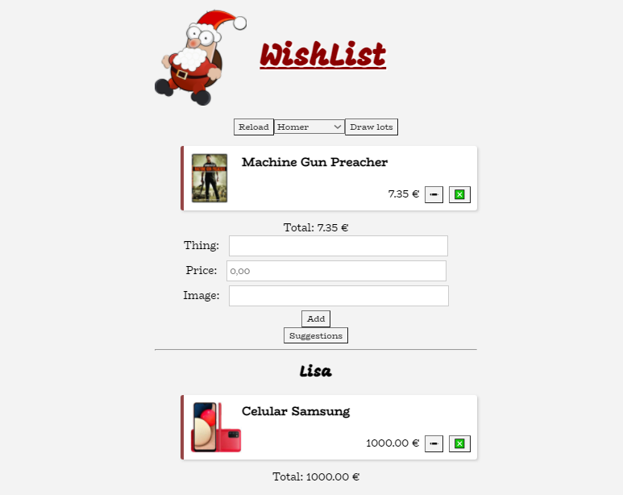

# Whishlist
> Wishlist desenvolvida ao longo do curso [Manage Application State with Mobx-state-tree](https://egghead.io/courses/manage-application-state-with-mobx-state-tree), da plataforma [egghead.io](https://egghead.io).
> A organização e gerenciamento dos estados da aplicação foi realizada por meio da biblioteca [Mobx-state-tree](https://mobx-state-tree.js.org/intro/welcome).
> Para simular a interação REST API da base de dados na qual os usuários e as listas de presentes são armazenadas, foi utilizada a biblioteca [json-server](https://github.com/typicode/json-server).

## Como utilizar

Para utilizar a aplicação, basta clonar ou fazer o download deste repositório, instalar as dependências, rodar o json-server e executar a aplicação:
```
npm install //instalar as dependências
npx json-server --port 3001 --watch db.json //rodar o json-server na porta 3001
npm start
```

## 🛠 Tecnologias utilizadas:

- [ReactJS](https://reactjs.org)
- [Mobx-state-tree](https://mobx-state-tree.js.org/intro/welcome)
- [json-server](https://github.com/typicode/json-server)
- [CSS](https://www.w3.org/TR/CSS/#css)

## 🧔 Autor
 

Feito por Gustavo Oliveira Dias 👋🏽

[](https://www.linkedin.com/in/gustavo-dias-22117012b/) 
[](mailto:gustavodias.god@gmail.com)
